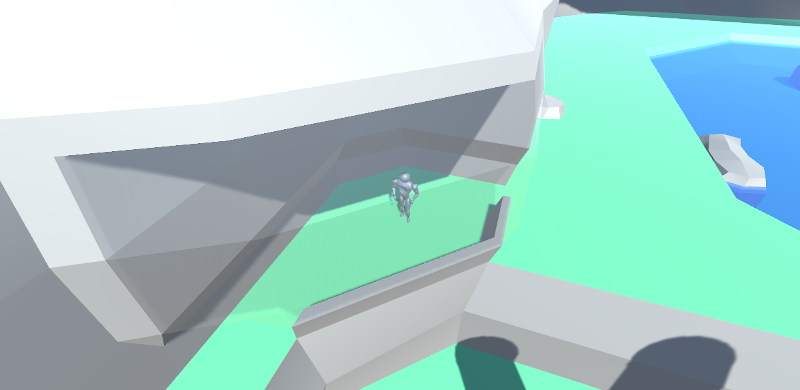
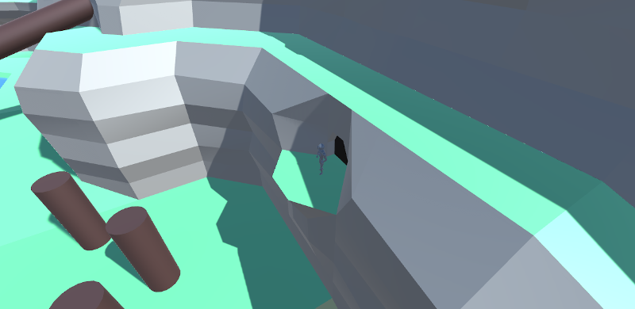
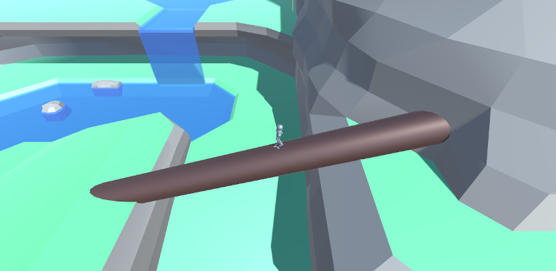
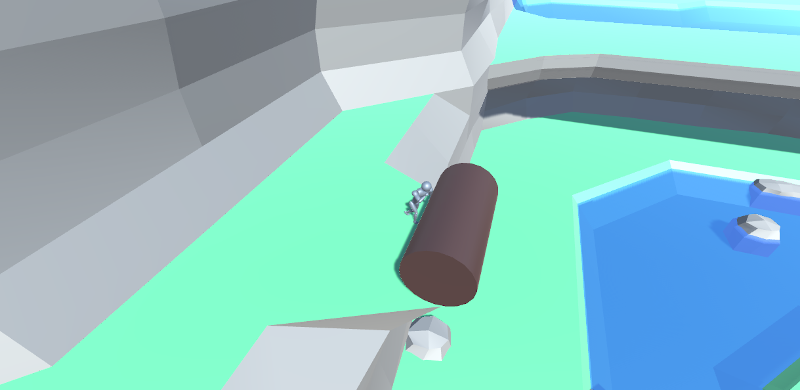

# BlockLand3D

This is a early prototype of a game i want to make, wich i started in 2019.
It was also helping me getting into Unity. The code is really not well programmed since i was on amateur level.

Hilights are the cave transitions and the player wich i sculpted and animated by myself.

